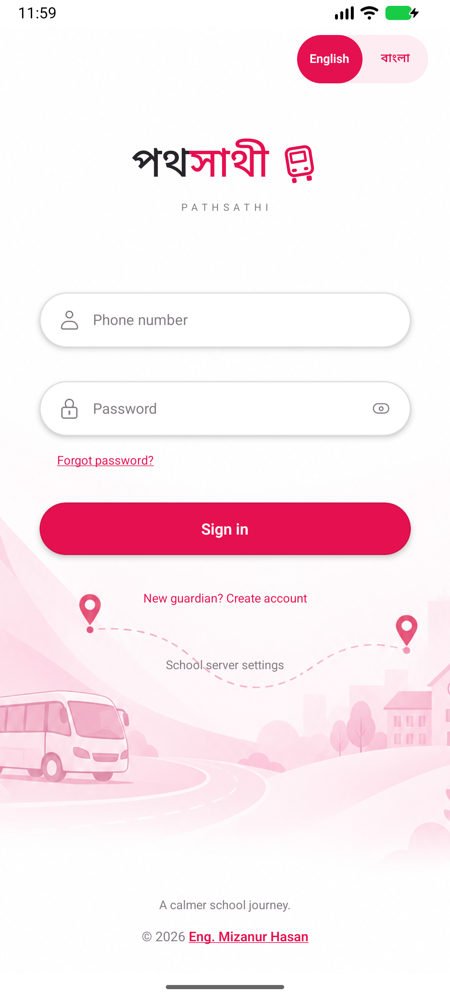
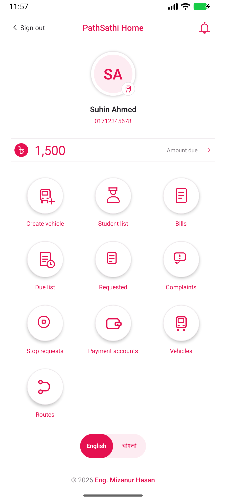
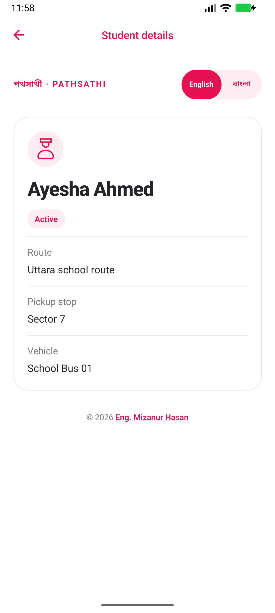
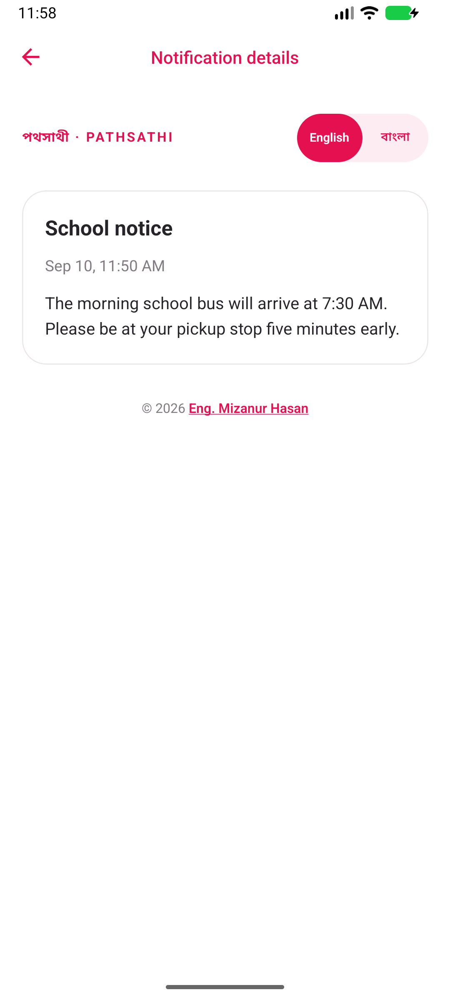

# Reference redesign — September 10, 2026

Implemented the supplied reference's white background, raspberry accent, centered
branding/profile, pill-shaped login controls, slim balance row, and circular
three-column dashboard. PathSathi names and transport features replace the wallet
content. No banking PIN is requested; existing phone/password authentication stays.

## Verification

- TypeScript and ESLint pass.
- 78 Jest tests across 15 suites pass, including dashboard destinations, role-aware
  shortcuts, unpaid/pending bill filtering, notification details and read mutation,
  credential validation, visibility, registration, and language persistence.
- Android ARM64 debug APK builds successfully.
- Production Android JavaScript bundle includes the generated transport image.
- Visual QA uses a temporary Android emulator and local fake API records.
  Screenshots contain fictional test data. All ten admin shortcuts opened the
  corresponding screen and returned through Android back navigation. Student
  drill-down and notification read persistence were exercised. At 320dp with
  1.3× text size, labels wrap and the dashboard scrolls to its final shortcut.
  Production school records and external payments were not used.

## Screenshots

## Background asset

Saved at `assets/branding/login-transport.png`. Generated with the built-in
imagegen tool. It is bundled locally and requires no image server.

Final generation prompt:

> Use case: stylized-concept. Asset type: background illustration for PathSathi school vehicle tracking Android login screen. Create a minimal, elegant portrait 1024x1536 illustration on pure white. Extremely soft blush pink geometric paper-cut shapes flowing diagonally from the middle left to lower right, a small modern school minibus in pale rose line art in the lower left, a gently winding dotted transport route and two location pins, subtle school skyline. Delicate low contrast monochrome blush (#FBE7EF, #F5C8D9), with tiny raspberry pink accents (#E51050). Upper 35 percent completely white for app logo; middle 35 percent mostly empty and very pale for overlaid login inputs. Illustration concentrated along side edges and lower quarter, bottom fades to white. Refined flat vector-like illustration, lots of white space. No text, no lettering, no logos, no UI, no phone frame, no people, no shadows around canvas.
