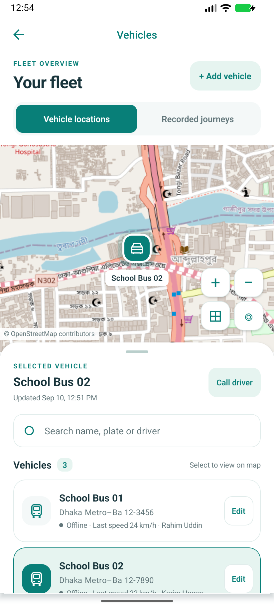
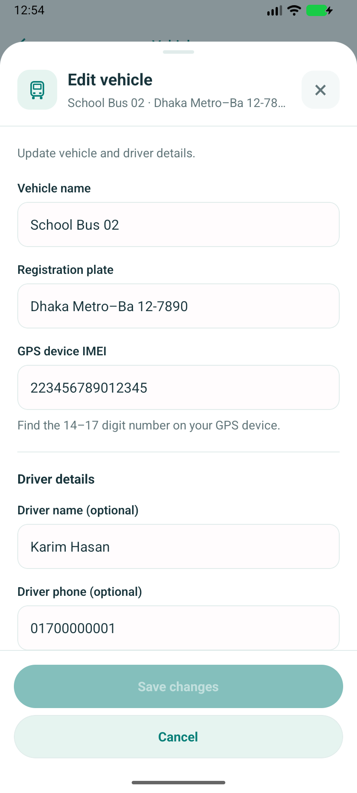
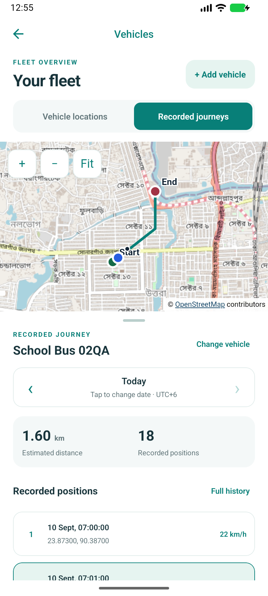
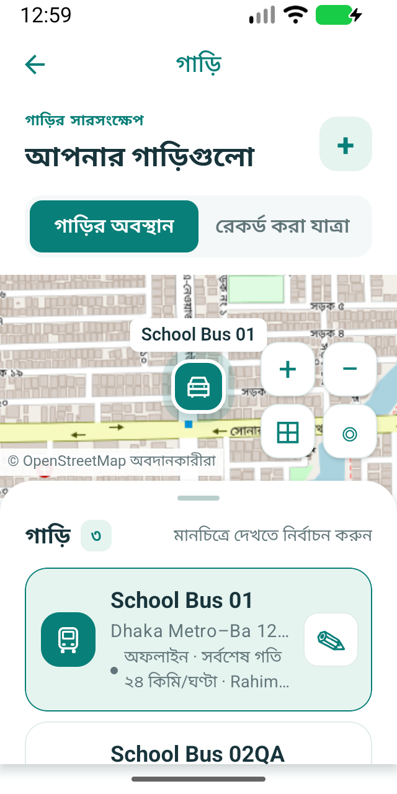

# Vehicles map redesign

The Vehicles screen now combines an interactive map with a searchable, expandable
bottom list. Selecting a vehicle from either surface updates the other. Rows show
plate, current/last-known status, speed and driver, with a separate admin Edit
button. The selected vehicle has a driver-call action. Admins can add vehicles,
edit through the existing PATCH endpoint, or switch to recorded journeys.

Recorded journeys show the actual stored route, a date selector, estimated distance,
and a scrollable list of saved positions. Selecting a position highlights it on the
map. Full history retains the existing period selection and playback tools. Missing
positions, disconnected reporting gaps, incomplete sync, and failed requests remain
explicit. Maps use the existing OpenStreetMap raster source and bundled rendering;
no additional native dependency was added.

Validation:
- TypeScript and ESLint pass.
- 116 tests across 21 suites pass. Added coverage checks bidirectional map/list
  selection, search, removed-vehicle fallback, admin/guardian access, edit validation,
  saved PATCH payloads, duplicate submission guards, date validation, selected history
  samples, loading/error states, and map payload/coordinate safety.
- Android emulator visual QA at 412 × 915 dp and 320 × 640 dp with 1.2× text and
  Bangla labels. Selected the second vehicle, saved its name against a local mock
  API, opened its recorded route and selected the second saved point. Checked list
  expansion and compact scrolling. All records used for QA were fictional.
- No new APK was built; verification ran the app through the local Metro server.

## Vehicle map and list

## Edit vehicle

## Recorded journey

## Compact Bangla list

