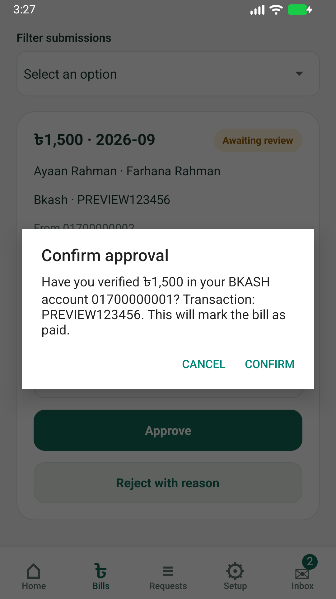
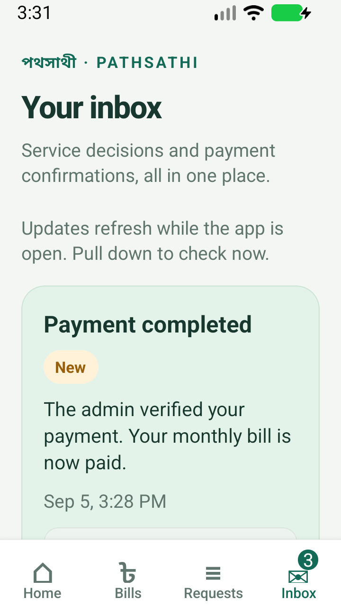

# Verification — 2026-09-05

All interactive checks used an isolated Android emulator and temporary API/SQLite
fixture data. No real transfer was made and no connected physical phone was
modified.

- API: 35 passing tests (HTTP lifecycle/access/payment cases plus existing GPS tests).
- Frontend: 11 passing tests (exact monetary conversion, manual submission,
  receiving-account changes during form entry, pending-state controls, and explicit
  admin confirmation/rejection validation).
- Both TypeScript checks passed; frontend ESLint passed; git whitespace checks passed.
- Final production JavaScript bundle generated successfully.
- Final ARM64 Android debug APK built successfully with JDK 17 / SDK 36.
- Emulator flow: secure guardian login → payment proof form → pending bill →
  admin login → explicit approval → guardian inbox payment-completed notification.
- Layout inspected at about 411dp width, then 320dp width with enlarged text.
  Scrollable content and bottom navigation remain usable.
- Found and fixed clipped tab labels by allowing adequate tab height and safe-area
  padding.
- Found and fixed a native activity-recreation crash while changing density/font
  settings. `MainActivity` now installs `RNScreensFragmentFactory` before its
  superclass restoration, following the installed react-native-screens README.
  Repeated the font-change/recreation scenario on the rebuilt APK; no new
  AndroidRuntime or ReactNativeJS errors appeared.

The native build reports upstream Gradle/deprecation warnings, and Node 24 labels
its built-in SQLite module experimental. These did not fail the build/tests.

## Screens

Admin confirmation, using fake preview data:

Guardian confirmation on a compact viewport with enlarged text:

## Not verified or included

- Live bKash/Rocket money movement (manual external process by design).
- Background FCM push notifications, payment gateway integration or iOS builds.
- Signed release distribution, Play Store publishing or remote deployment.
- Production load testing, multiple API instances or a PostgreSQL deployment.

Run commands and operational limitations are in the two project READMEs.

## GPS history implementation verification

- Android TypeScript and ESLint passed with the new admin history flow.
- Jest: 23 tests passed across six suites, including Dhaka boundaries, invalid
  dates, year/leap-month changes, map segment/size validation, guardian denial,
  pending history, day drill-down, abort/race handling, 401/503 and retaining
  summaries when route rendering is rejected as too large.
- Production JavaScript bundle generated; ARM64 debug APK built successfully
  using JDK 17 and the installed Android SDK. Upstream Gradle warnings remain.
- A separate reviewer extracted and executed the bundled map script against a
  simulated DOM: initial render, separate segments, marker, zoom, Fit and pan.
- Integration lead completed emulator acceptance against isolated PostgreSQL/API
  fixtures: admin login, fleet history, correct day/week/month ranges, real map
  tiles, segmented route and moving playback marker. See the workspace
  `GPS_HISTORY_VERIFICATION.md` for evidence and production boundaries.

- Emulator integration found a malformed map button tag which caused map script
  initialization to fail. Fixed the tag and added a jsdom regression that parses
  the actual HTML and executes initialization, zoom, Fit and playback against
  real DOM elements. The earlier simulated-DOM test did not detect this defect.
